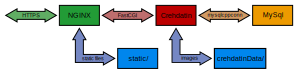
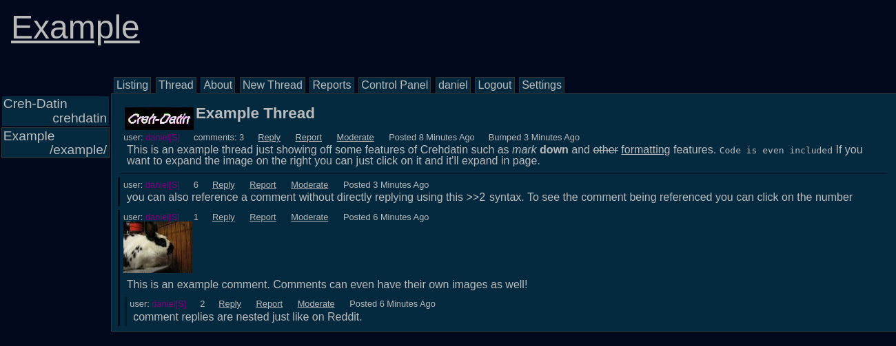
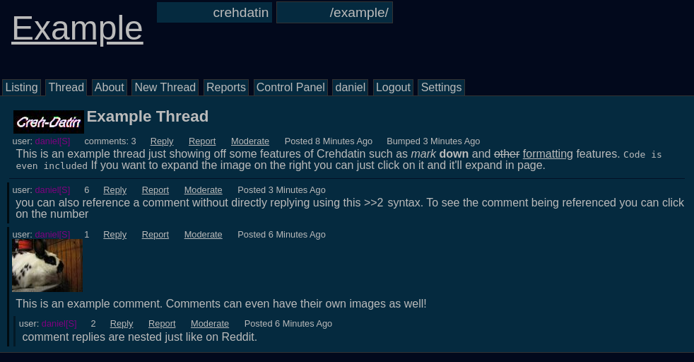
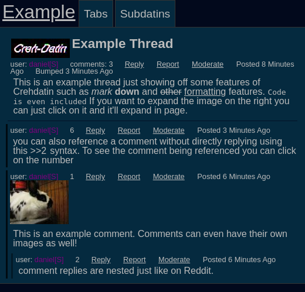

# Creh-Datin

**Creh-Datin** is a Reddit and image-board mix written in C++. It is structured as a FastCGI gateway that fulfills requests through [Nginx](https://nginx.org/), though it should work with any program that implements the FastCGI protocol. It uses MySQL for storing all data except image files, though MySQL is used to keep track of file locations.

Crehdatin is feature rich and supports:
- Posting threads in "Subdatins"
- Commenting with Reddit-style nested comments
- Images can be posted alongside threads and comments
  - Thumbnail hiding for images
  - Images can also be expanded in-page
- Posts can include markdown elements
  - Links
  - Text Styles
  - Comment references with hover previews
- Posts can be made both with or without an account
- Layered administration model with different ranks
  - Officials can sticky and/or lock threads and moderate user content
  - Includes per-subdatin ranks
- Post reporting
- Built in "Captchas" with no outside dependencies
- Built in anti-bot detection
- Password hashing and salting built around the "scrypt" algorithm
- Per-user CSS themes
- Per-user editable subdatin list
- Full mobile and tablet versions
- Full UTF-8(non-english language) support from the beginning
- Built around a specially built C++ FastCGI "WebsiteFramework" which supports multithreading to maximize performance
  - Includes features to make XSS impossible; all strings are escaped by default
- SQL injection is impossible due to use of Prepared Statements
- No dependencies on any other websites

All interactive webpage elements are currently implemented purely with HTML and CSS without any Javascript in the entire website. This is to maximize compatability with mobile and lower-end platforms. Tests showed that when Crehdatin's interactive elements were implemented in CSS they were more responsive than the same ones in javascript even when viewed on a desktop. This does not mean Crehdatin is lacking in interactive menus or fancy input boxes, it just means that those features were implemented using clever CSS elements instead of more traditional Javascript. Crehdatin is not anti-Javascript, but all features currently implemented do not require the use of Javascript.

[Example Nginx config for Crehdatin](exampleNginx.conf)

For more about the terminology used for the different parts of the website and for more about how the different ranks interact with eachother go [here](namesAndRanks.md)

## Example in Action

The following are pictures of the website in action while showing off some of the different features. All images use the "flat dark" theme, but there are several other themes available too.

Example thread with the desktop version

Example thread with the tablet version

Example thread with the mobile version

## Dependencies
- The "WebsiteFramework" library, which is included in this project and made specifically for Crehdatin
- scrypt implementation from [here](https://www.tarsnap.com/scrypt.html), a copy of which is included in this project
- fcgi++
- fcgi
- pthread
- boost_system
- boost_filesystem
- crypto++
- cgicc
- mysqlcppconn
- graphicsmagick

